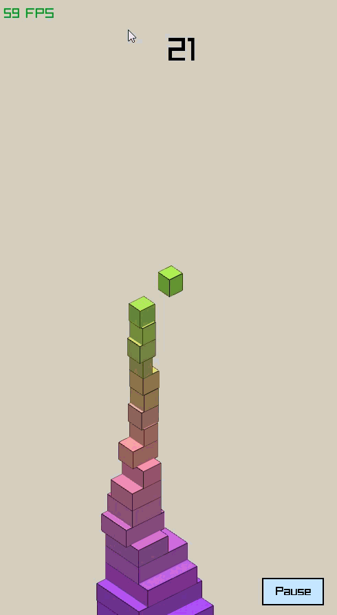

# Stack-RAY
A tile stacking game in raylib and rust

# Dependencies
- Raylib
- Rand
- Chrono
- and ofcourse Rust

# Build From Source
```bash
cargo add raylib
cargo add rand
cargo add chrono

git clone
cd
cargo build --release
cargo run
```



